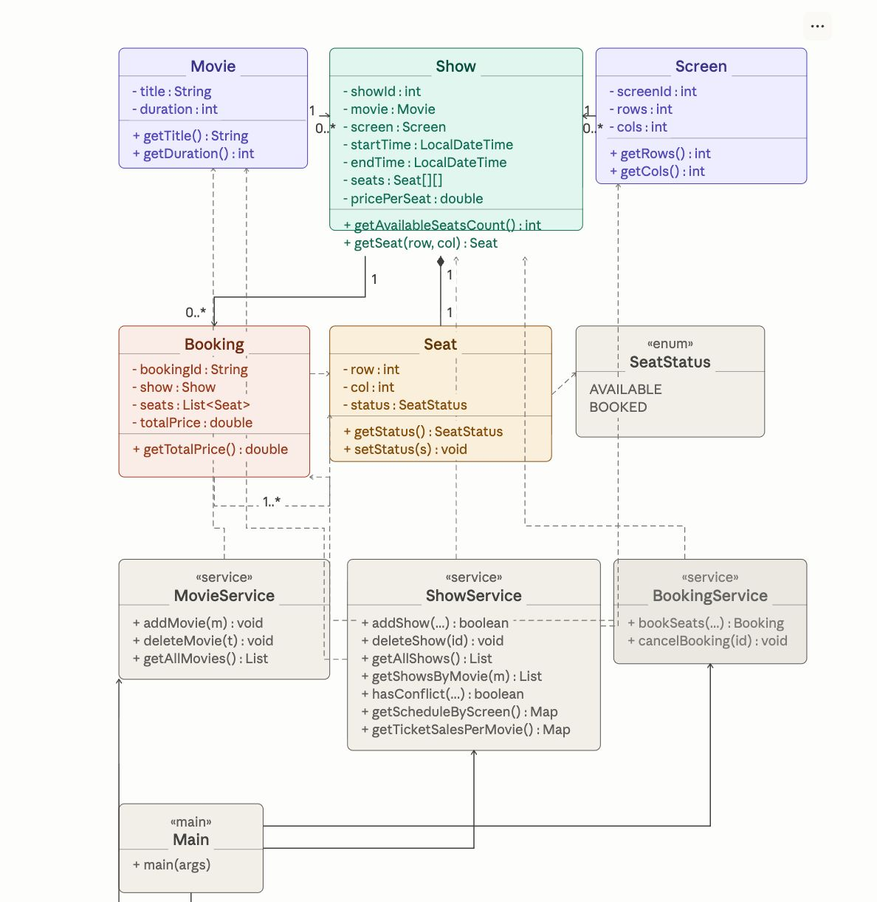

# 🎬 Cinema Movie Scheduling System

Welcome to the **Cinema Movie Scheduling System**! This is a Java GUI application built for CSCI 217 – Advanced Computer Programming. It simulates a real-world cinema environment, making it super easy to manage schedules and book tickets.

## ✨ What Can You Do?

The application is designed for two main types of users:

### 🍿 For Moviegoers (Users)
* **Discover Movies**: Browse what's playing, check out durations, and find the perfect show time.
* **Pick Your Seats**: Choose exactly where you want to sit using an interactive 2D grid. 
  * 🟢 **Available**
  * 🔴 **Booked**
  * 🟡 **Selected**
* **Book & Manage Tickets**: Confirm your booking to receive a unique ID, which you can also use to cancel if your plans change!

### 👨‍💼 For Staff (Admins)
* **Manage the Lineup**: Add or remove movies and schedule their showtimes on different screens.
* **Smart Scheduling**: The system is smart enough to automatically block you from scheduling two movies on the same screen at the exact same time.
* **Track Sales**: Keep an eye on the schedule and view ticket sales for every movie.

## 🏗️ Under the Hood

The project is structured with clean code in mind! It follows strict **OOP principles** and uses a layered architecture (Model → Service → UI) to keep everything organized. 

To see exactly how the `Movie`, `Show`, `Seat`, and `Booking` classes talk to each other, check out the project architecture diagram below!

*📌 System Architecture:*


## ▶️ Getting Started

Ready to run the cinema? Make sure you have **Java 11 or higher**.

1. **Compile the project:**
   ```bash
   javac -d out src/**/*.java
   ```
2. **Run the app:**
   ```bash
   java -cp out Main
   ```

---
*Built with clean design and correctness in Java Swing/JavaFX (Computer Science Student).*
