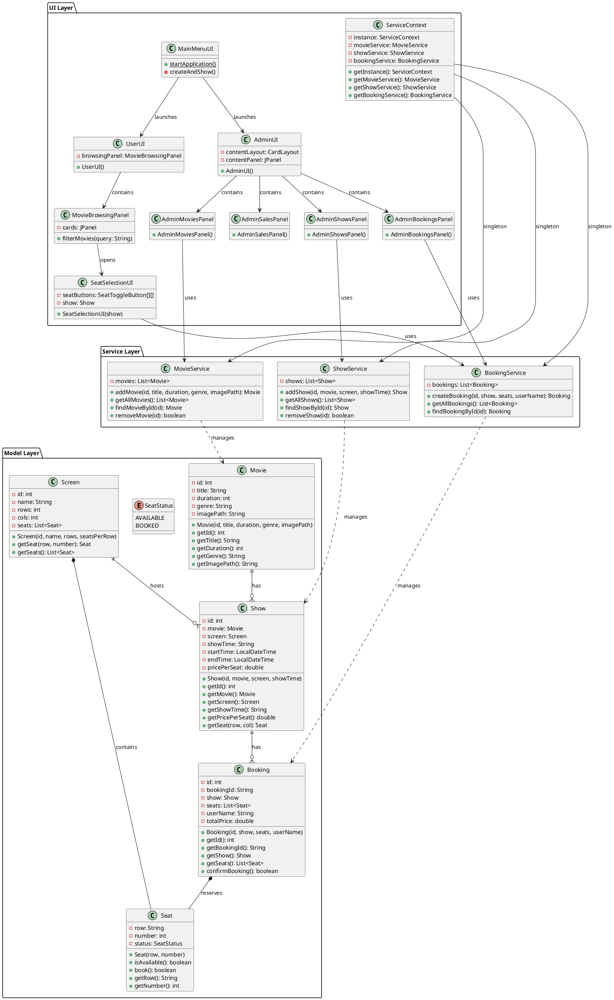
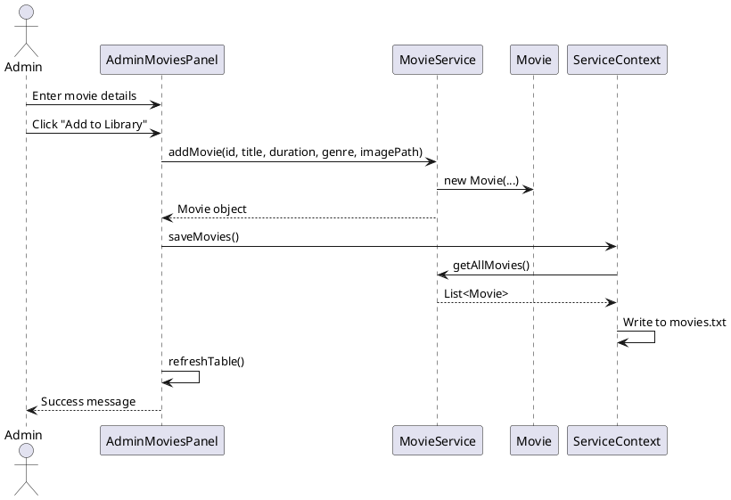
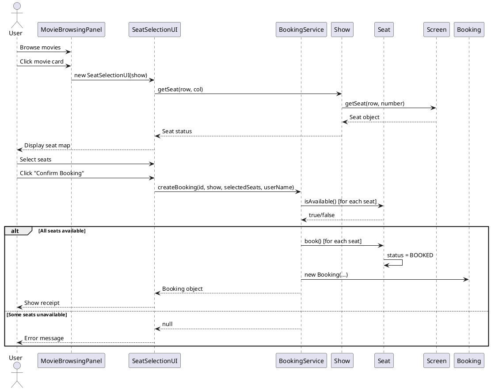
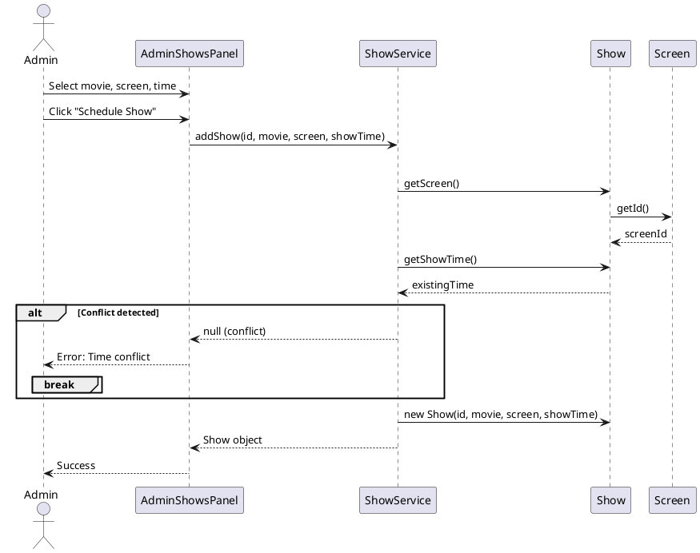
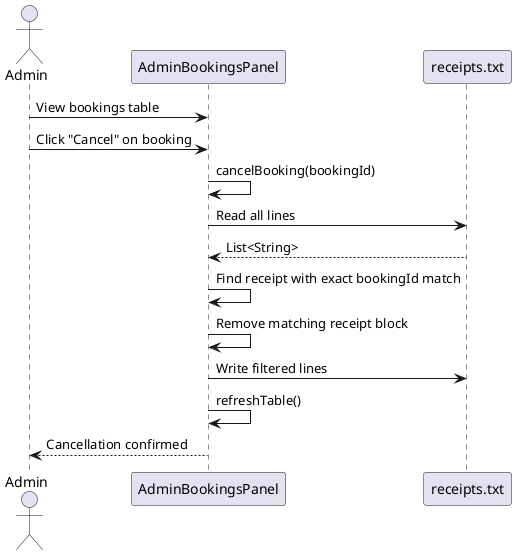
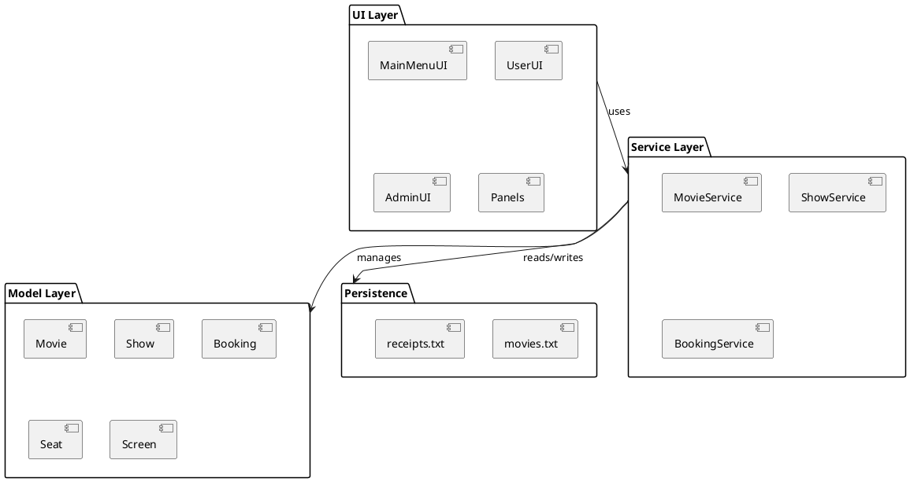
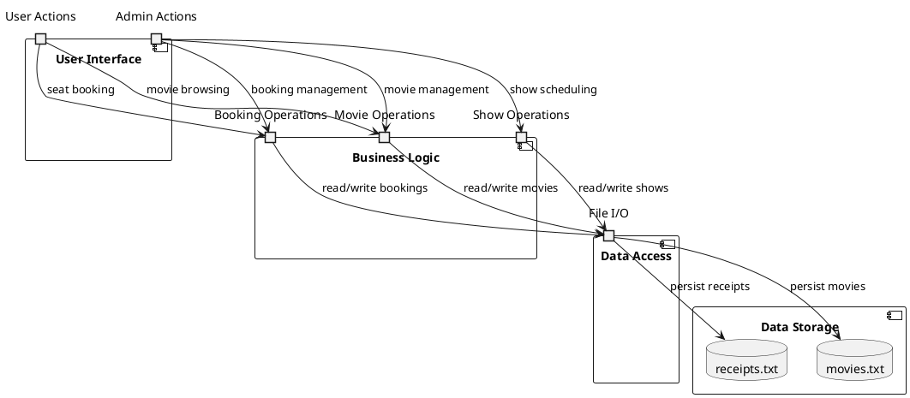
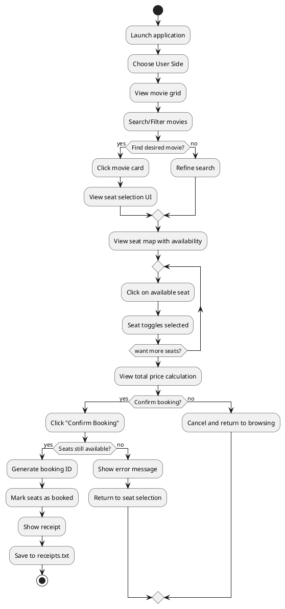
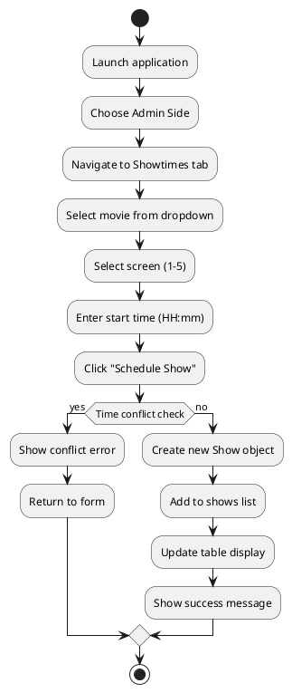

# 📐 Cinema Scheduling System - UML & Sequence Diagrams

*Complete diagram specifications for generating visual architecture diagrams*

---

## 🎯 Class Diagram (UML)

### PlantUML Code for Class Diagram

---

## 🔄 Sequence Diagrams

### 1. Movie Addition Sequence

### 2. Seat Booking Sequence

### 3. Show Scheduling with Conflict Detection

### 4. Booking Cancellation Sequence

---

## 🏗️ Package Diagram

---

## 📊 Component Diagram

---

## 🔄 Activity Diagrams

### User Movie Booking Activity

### Admin Show Scheduling Activity

---

## 🛠️ How to Generate Diagrams

### Using PlantUML
1. Copy the PlantUML code above
2. Use an online PlantUML viewer: https://plantuml.com/
3. Or install PlantUML plugin in VS Code
4. Paste code and generate diagrams

### Using Draw.io
1. Import the PlantUML code
2. Or manually create diagrams using the specifications above

### Key Diagram Elements
- **Classes**: Rectangles with compartments (name, attributes, operations)
- **Relationships**: Lines with different arrowheads
- **Packages**: Large rectangles containing classes
- **Actors**: Stick figures for external users
- **Lifelines**: Dashed vertical lines in sequence diagrams
- **Messages**: Horizontal arrows between lifelines

---

## 📋 Diagram Explanations

### Class Diagram
- Shows the static structure of the system
- Illustrates inheritance, composition, and associations
- Helps understand object relationships and dependencies

### Sequence Diagrams
- Show dynamic interactions between objects
- Demonstrate the flow of messages over time
- Critical for understanding system behavior

### Package Diagram
- Shows high-level organization
- Illustrates dependencies between layers
- Helps understand architectural boundaries

### Component Diagram
- Shows runtime components and their interfaces
- Illustrates data flow between components
- Useful for deployment and integration planning

### Activity Diagrams
- Show workflow and decision points
- Illustrate user journeys through the system
- Help identify bottlenecks and alternative paths

---

*Use these specifications to generate professional UML diagrams for your portfolio or documentation.*