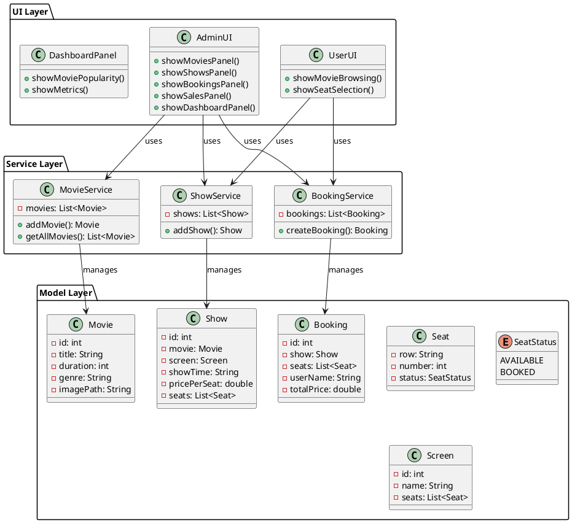
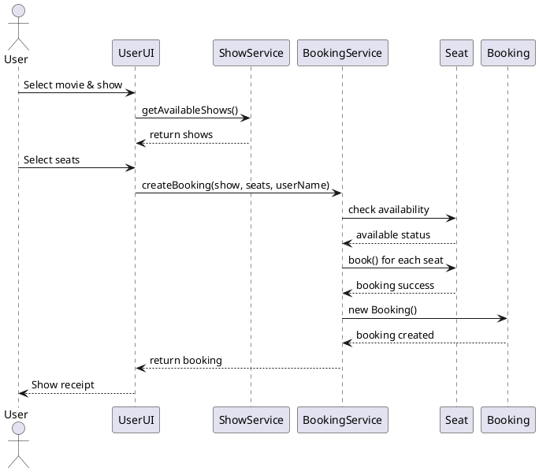
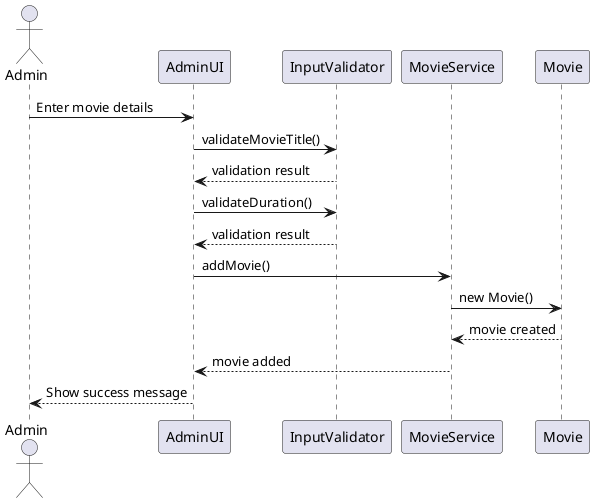
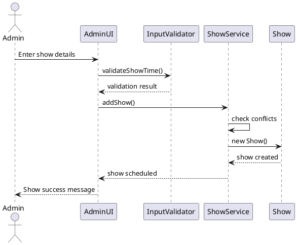

# 📐 Cinema Scheduling System - UML Diagrams

## 🎯 Class Diagram

```plantuml
@startuml Cinema System Class Diagram

package "Model Layer" {
    class Movie {
        - id: int
        - title: String
        - duration: int
        - genre: String
        - imagePath: String
    }

    class Show {
        - id: int
        - movie: Movie
        - screen: Screen
        - showTime: String
        - pricePerSeat: double
        - seats: List<Seat>
    }

    class Booking {
        - id: int
        - show: Show
        - seats: List<Seat>
        - userName: String
        - totalPrice: double
    }

    class Seat {
        - row: String
        - number: int
        - status: SeatStatus
    }

    enum SeatStatus {
        AVAILABLE
        BOOKED
    }

    class Screen {
        - id: int
        - name: String
        - seats: List<Seat>
    }
}

package "Service Layer" {
    class MovieService {
        - movies: List<Movie>
        + addMovie(): Movie
        + getAllMovies(): List<Movie>
    }

    class ShowService {
        - shows: List<Show>
        + addShow(): Show
    }

    class BookingService {
        - bookings: List<Booking>
        + createBooking(): Booking
    }
}

package "UI Layer" {
    class AdminUI {
        + showMoviesPanel()
        + showShowsPanel()
        + showBookingsPanel()
        + showSalesPanel()
        + showDashboardPanel()
    }

    class UserUI {
        + showMovieBrowsing()
        + showSeatSelection()
    }

    class DashboardPanel {
        + showMoviePopularity()
        + showMetrics()
    }
}

MovieService --> Movie : manages
ShowService --> Show : manages
BookingService --> Booking : manages
AdminUI --> MovieService : uses
AdminUI --> ShowService : uses
AdminUI --> BookingService : uses
UserUI --> ShowService : uses
UserUI --> BookingService : uses

@enduml
```

## 🔄 Sequence Diagrams

### Booking Process

```plantuml
@startuml Booking Sequence

actor User
participant UserUI
participant ShowService
participant BookingService
participant Seat
participant Booking

User -> UserUI: Select movie & show
UserUI -> ShowService: getAvailableShows()
ShowService --> UserUI: return shows
User -> UserUI: Select seats
UserUI -> BookingService: createBooking(show, seats, userName)
BookingService -> Seat: check availability
Seat --> BookingService: available status
BookingService -> Seat: book() for each seat
Seat --> BookingService: booking success
BookingService -> Booking: new Booking()
Booking --> BookingService: booking created
BookingService --> UserUI: return booking
UserUI --> User: Show receipt

@enduml
```

### Admin Movie Addition

```plantuml
@startuml Admin Movie Addition

actor Admin
participant AdminUI
participant InputValidator
participant MovieService
participant Movie

Admin -> AdminUI: Enter movie details
AdminUI -> InputValidator: validateMovieTitle()
InputValidator --> AdminUI: validation result
AdminUI -> InputValidator: validateDuration()
InputValidator --> AdminUI: validation result
AdminUI -> MovieService: addMovie()
MovieService -> Movie: new Movie()
Movie --> MovieService: movie created
MovieService --> AdminUI: movie added
AdminUI --> Admin: Show success message

@enduml
```

### Show Scheduling

```plantuml
@startuml Show Scheduling

actor Admin
participant AdminUI
participant InputValidator
participant ShowService
participant Show

Admin -> AdminUI: Enter show details
AdminUI -> InputValidator: validateShowTime()
InputValidator --> AdminUI: validation result
AdminUI -> ShowService: addShow()
ShowService -> ShowService: check conflicts
ShowService -> Show: new Show()
Show --> ShowService: show created
ShowService --> AdminUI: show scheduled
AdminUI --> Admin: Show success message

@enduml
```
